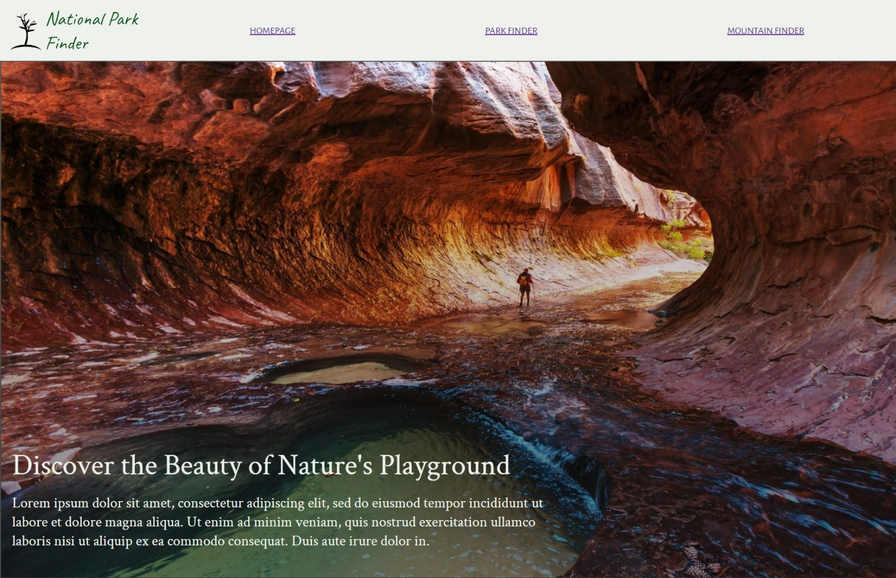

# Capstone-2-Enjoy-The-Outdoors

My project is a website for find national parks in the US. It was created to practice using arrays and dynamacally acessing its data. 

##Pages 

## Biggest Challenge

My biggest challenge in this project was figuring out a way to use CSS Grid and Flexbox and display the array items dynamically as they were being selected. How was I supposed to style elements thats weren't yet created? As a solution, I used dyanamic variables and conditional loops to create display cards and place them into rows after after 3rd card was created.

## Things to Improve 
I feel like the code to create and display the cards/rows were repeated multiple times throughout. I would like to create a function for it instead of having to repeat all those lines each time I use it. 

In terms of styling, I would add images to the display cards, edit the colors of the images, and overall spaceing needs improvements.